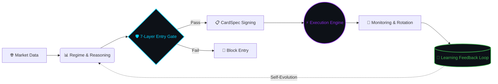

<div align="center">


# 🧭 Deep Reasoning OS (DROS)

**Research-first AI trading architecture for crypto futures — deterministic safety, adaptive grid execution, and self-improving learning.**

*16-Agent Autonomous Crypto Quant OS · Optimized for Apple Silicon*


</div>

---

## 💡 What is DROS?

**Deep Reasoning OS (DROS)** is a multi-agent autonomous trading system for **Binance USDT perpetual futures**.

16 AI agents collaborate in a structured pipeline — from market data ingestion, direction reasoning, and safety validation, through to execution, monitoring, and recursive self-learning.

DROS is not a single-script trading bot.  
It is a **layered operating architecture** for decision, execution, validation, and continuous improvement.

> *"We don't outscale Wall Street. We outsee them."*

---

## ⚔️ Why DROS? — The Asymmetric Edge

Most crypto grid bots are static. DROS is different at every layer.

| Feature | Typical Grid Bot | **DROS v11.20** |
| :--- | :---: | :---: |
| **Architecture** | Single script | **16-Agent collaborative pipeline** |
| **Grid Spacing** | Fixed value | **Yang-Zhang volatility · SpacingOracleSSOT** |
| **Direction** | Neutral only | **Ensemble ML + Game Theory prediction** |
| **Learning** | None | **AWR + Thompson Sampling dual online loop** |
| **Safety** | Simple stop-loss | **7-Layer Safety + liquidation probability** |
| **Microstructure** | Ignored | **VPIN + OFI + CFR toxicity detection** |
| **Evolution** | Manual updates | **AI Evolution Lab · OODA loop · Digital Twin** |
| **Deployment** | Direct to live | **Shadow → Canary → Production validation** |

---

## ⚙️ System Flow



**Execution comes only after deterministic validation. Every time.**

---

## 🧠 Core Components

### 1. Direction Engine v5.0
Ensemble ML (XGBoost · LightGBM · MLP) with Isotonic Regression calibration, Purged+Embargo CV validation, and dynamic threshold policy gates. LLM acts as a structurer — never a decision maker.

### 2. SpacingOracleSSOT
Single source of truth for dynamic grid spacing. Yang-Zhang volatility estimation with 10% hysteresis and 30-minute cooldown. All agents reference one oracle — no duplicate calculations.

### 3. Entry Gate (7-Layer Safety)
Deterministic multi-layer validation before any order is sent. Macro sentiment veto, tail risk veto, direction uncertainty block, range extreme check, toxicity shield, liquidation probability gate, and card freshness gate.

### 4. Execution Engine (v11.20)
Rolling grid execution with TP/SL monitoring, ORPHAN position management, adaptive slot allocation (AOSM v2), and atomic checkpoint writes. 10,973-line production core.

### 5. Learning Engine
Two-layer online learning: **AWR Agent** (per-heartbeat dense reward MDP) + **Thompson Sampling Bandit** (per-rotation preset selection). Bayesian Learning Subprocess (BLS) runs in isolated subprocess for memory safety.

### 6. Microstructure Engine
VPIN + OFI toxicity fusion via SharedMemory (lock-free, <0.01ms). Avellaneda-Stoikov inventory pressure. Game-theoretic stealth execution with ±15% order jitter + Poisson timing.

### 7. AI Evolution Lab v3
13-module self-evolution system via EnhancerBus (Strangler Fig pattern). Alpha Foundry (MAP-Elites genome evolution) + OODA Loop (offline 03:00–09:00 KST) + Digital Twin (EPE/FRE/LPE parity) + Black Swan Ensemble (2/4 vote: ADWIN+CUSUM+BOCPD+Hawkes).

---

## 🛡️ Safety First

> **"Execution comes after validation. Always."**

DROS checks every condition before sending a single order:

| Gate | Check |
| :--- | :--- |
| `Macro Sentiment` | PSI ≤ −0.5 → Long blocked |
| `Tail Risk` | tail_risk ≥ 0.8 → All entry blocked |
| `Direction Uncertainty` | \|p_dir − 0.5\| ≤ 0.05 → Neutral zone blocked |
| `Range Extreme` | Price at range boundary → blocked |
| `Toxicity Shield` | VPIN toxicity score threshold → blocked |
| `Liquidation Probability` | liq_distance < safety threshold → blocked |
| `Card Freshness` | card_age > 5,400s → slot fill blocked |

The goal is not just performance. The goal is **survivable performance**.

**Battle-tested against real liquidation events:**
- 2026-02-02 · MERLUSDT · SHORT vs +37% LONG rally → 100% liquidation → 5-layer defense added
- 2026-02-04 · CLO/USDT · p_dir=0.50 uncertainty → Neutral Zone ±5% gate added

---

## 🔬 AI Evolution Lab v3

Strategy evolution under strict scientific discipline.

```
New Hypothesis → Research Lab (POPPER E-value)
              → Counterfactual Lab (OPE Capped SNIPS)
              → Digital Twin (EPE/FRE/LPE parity <5%)
              → Shadow (min. 7 days)
              → Canary (10% traffic, SPA p<0.01)
              → Production
```

**Active modules (Production):** ACI Risk · EventStore (SQLite WAL) · Digital Twin · Counterfactual Lab · Black Swan Ensemble · Alpha Foundry · OODA Loop

**Key invariants:** No direct deployment without shadow. No post-hoc hypotheses. Black Swan requires 2/4 ensemble vote. OODA Decide/Act is offline-only.

---

## 📦 Public Scope — Open-Core

This repository is the **public-facing documentation layer** of DROS.

**🟢 Included**
- Architecture overview and system diagrams
- Agent pipeline documentation
- Safety gate specifications
- Learning pipeline design
- Evolution Lab architecture
- Invariant contract references

**🔴 Not Included**
- Live API keys or exchange credentials
- Private runtime state or checkpoint files
- ML model weights or trained parameters
- Production deployment configurations
- Proprietary execution infrastructure
- Sensitive strategy parameters

---

## 📚 Documentation

| Document | Description |
| :--- | :--- |
| [Architecture](./docs/architecture.md) | Full system architecture and agent pipeline |
| [Agents](./docs/agents.md) | 16-Agent roles, contracts, and interaction patterns |
| [Safety](./docs/safety.md) | 7-Layer Entry Gate and invariant contracts |
| [Learning](./docs/learning.md) | AWR + Thompson Sampling + BLS pipeline |
| [Execution](./docs/execution.md) | v11 execution engine, AQER, AOSM |
| [Evolution Lab](./docs/evolution-lab.md) | AI Evolution Lab v3 — 13 modules |

---

## 📊 Codebase (Private Repository)

| Metric | Value |
| :--- | :--- |
| Total Python | ~1,090,000 lines |
| Core Daemon | 10,973 lines · 156 functions |
| Test Files | 442 |
| Service Modules | 100 |
| Contract Definitions | 43 |
| Evolution Modules | 53 |

---

## 🛠️ Tech Stack

**Runtime:** Python 3.13+ · Apple MLX (M4 Pro NPU) · SQLite WAL  
**ML:** XGBoost · LightGBM · PyTorch · pyribs MAP-Elites · FAISS  
**Algorithms:** Yang-Zhang Vol · Triple-Barrier · CPCV · CFR/DCFR · VPIN+OFI · AWR · BOCPD · Hawkes  
**Infra:** Binance Futures REST+WebSocket · macOS launchd · POSIX SharedMemory · asyncio

---

## 📡 Community & Research

DROS real-time Black Swan alerts and daily alpha signals are shared exclusively in the official research channel.

[](https://t.me/your_channel)

**💼 Institutional / B2B Inquiries:** `your@email.com`  
**🐦 X / Twitter:** `@your_handle`

---

## 📋 Status

| Item | Detail |
| :--- | :--- |
| Version | v11.20 |
| Platform | Binance USDT Perpetual Futures |
| Runtime | Apple M4 Pro · Python 3.13+ |
| Repository | Public architecture overview |
| Production | Live trading (private system) |

---

<div align="center">

*DROS is a quantitative research and systems architecture project.*  
*Nothing in this repository constitutes financial advice, investment solicitation, or a guarantee of future performance.*  
*All signals, architecture notes, and examples are for informational and research purposes only.*

</div>
