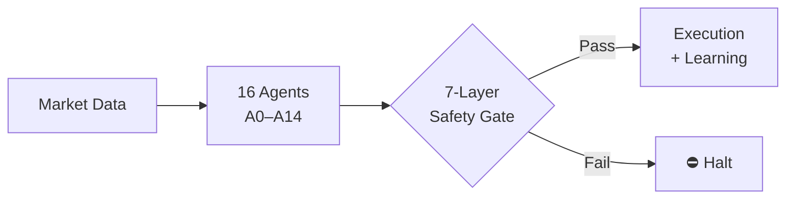
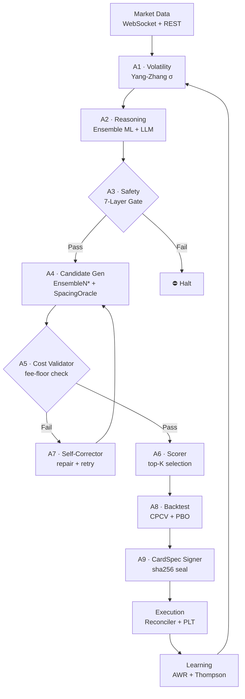

# 🧠 Deep Reasoning OS (DROS)

**Research-first crypto futures trading architecture powered by
16 cooperative agents, deterministic safety, and recursive learning.**

[📖 Docs](#-documentation) · [🗺️ Roadmap](./ROADMAP.md) · [📡 Community](#-dros-research-community) · [🏢 Enterprise](#-enterprise--partnerships)

---

## The Story

Grid trading bots fail for one reason: static parameters in a dynamic market.
I kept watching positions get liquidated — not from bad strategy, but from
spacing parameters that couldn't adapt to volatility shifts in real time.

DROS is the system I built to solve that.

Developed solo on an **Apple M4 Pro** (24GB unified memory), using
**Claude and GPT** as development partners for rapid iteration —
compressing what would have been years of research into a
production-grade 16-agent system running 24/7.

Every architecture decision is documented. Every failure is on record.

> *The [MERL liquidation](./docs/case-study-merl/) — a SHORT position hit by a +37% LONG rally — is what built the 7-layer safety gate.*

---

## Why DROS?

| Capability | Typical Algo Bot | DROS |
|:---|:---:|:---:|
| **Agents** | 1 execution engine | 16 cooperative agents |
| **Learning** | None or batch retrain | AWR + Thompson Sampling (real-time) |
| **Safety** | Stop-loss only | 7-Layer Entry Gate · 43 invariant contracts |
| **Microstructure** | Price and volume only | Informed-flow detection · game-theoretic defense |
| **Deployment** | All-or-nothing | Shadow → Canary → Production |
| **Transparency** | Closed | Open architecture, closed execution |

---

## Who This Is For

| | |
|:---|:---|
| **🔬 Builders & Researchers** | Architecture docs, agent design, academic references, validation methodology |
| **📡 Traders & System Nerds** | Weekly public-safe research notes, regime observations, system evolution updates |
| **🏢 Partners & Buyers** | Private architecture briefing, DROS deck, NDA discussion |

---

## Architecture

Expand full pipeline diagram

→ [Full architecture documentation](./docs/architecture.md)

---

## Core Pillars

<strong>🤖 16-Agent Cooperative Pipeline</strong>

Each agent owns exactly one responsibility. No agent recomputes another's output (SSOT principle).

| Agent | Role | Key Output |
|:---|:---|:---|
| A0 | Orchestrator | Execution order, exception routing |
| A1 | Data & Features | Yang-Zhang σ, ATR, funding rate, sentiment |
| A2 | Reasoning Engine | Ensemble ML + LLM-structured bias |
| A3 | Safety Guardian | Pre-entry risk block |
| A4 | Candidate Generator | N_total (EnsembleN*), spacing_dec (SpacingOracleSSOT) |
| A5 | Cost Validator | Fee-floor compliance |
| A6 | Scorer & Selector | Top-K grid configuration |
| A7 | Self-Corrector | Repairs failed candidates — only agent allowed to re-sign |
| A8 | Backtest Simulator | CPCV + PBO overfitting guard |
| A9 | CardSpec Officer | Immutable sha256-sealed trade spec |
| A10 | Execution Manager | Staging → Observe → Live FSM |
| A11 | Risk Governance | Exposure, leverage, loss limits |
| A12 | SRE Monitor | KPI tracking, runbook automation |
| A13 | Debug & QA | Contract enforcement, unit guard |
| A14 | Reliability Analyst | Confidence and reliability scoring |

<strong>🛡️ 7-Layer Safety Gate</strong>

Every trade passes all seven layers sequentially. One failure halts the pipeline.

1. **Macro Sentiment Veto** — regime indicator threshold
2. **Tail Risk Veto** — tail risk score threshold
3. **Direction Uncertainty Block** — prediction confidence below abstain level
4. **Range Extreme Check** — price at grid boundary
5. **ToxicityShield / VPIN** — informed-flow toxicity detection
6. **Liquidation Probability** — margin safety validation
7. **AQER StaleGate** — card freshness TTL

→ [Full safety documentation](./docs/safety.md)

<strong>🔬 AI Evolution Lab v3</strong>

Thirteen modules applying the Strangler Fig pattern — new strategies run in shadow before touching capital.

- **Alpha Foundry**: MAP-Elites genome search over grid parameter space
- **OODA Loop**: Boyd's Observe-Orient-Decide-Act, offline only (03:00–09:00 KST)
- **Digital Twin**: Mirror engine tracking live/shadow parity
- **Counterfactual Lab**: Off-policy evaluation of untested strategies
- **Black Swan Ensemble**: 2-of-4 detector vote (ADWIN, CUSUM, BOCPD, Hawkes)
- **ACI Risk Controller**: Adaptive conformal inference for dynamic risk bounds

Graduation path: Shadow (7 days min) → Canary (10%) → Production (SPA p < 0.01)

→ [Evolution Lab documentation](./docs/evolution-lab/)

<strong>📚 Dual Online Learning</strong>

Two independent learning loops run continuously without stopping execution.

| Loop | Method | Cadence | Role |
|:---|:---|:---|:---|
| Fast | AWR (Advantage-Weighted Regression) | Per heartbeat | Grid parameter adaptation |
| Slow | Thompson Sampling Bandit | ~30 min per symbol | Preset configuration selection |

Additional layers: Bayesian Learning Subprocess (memory-isolated), CPCV + PBO overfitting guard, hierarchical ROI debiasing (symbol → cluster → global), adaptive calibration.

→ [Learning system documentation](./docs/learning.md)

<strong>🔒 CardSpec Immutability</strong>

Every trade is governed by a **CardSpec** — a cryptographically sealed parameter set.

- Generated by A4 (SpacingOracleSSOT, EnsembleN*)
- Validated by A5 (fee-floor), A8 (backtest), A6 (scoring)
- Sealed by A9 with sha256(code + contracts + cardspec)
- **Immutable after signing** — any mutation triggers `FAIL_CARDSPEC_MUTATION` (P0 halt)
- A7 is the only agent permitted to re-sign (self-correction path only)

No parameter drift. No silent overrides. What was validated is what gets executed.

<strong>📐 Open Architecture, Closed Execution</strong>

DROS separates what is public from what is private by design.

**Public**: Architecture principles, agent roles, safety gate structure, learning methodology, academic references, invariant contract names, MERL liquidation case study.

**Private**: Production daemon implementation, exact thresholds, ML weights, learned presets, live positions, API credentials.

This boundary is intentional. The architecture is transparent; the edge is not.

→ [Open Architecture documentation](./docs/open-architecture/)

---

## System Snapshot

| Component | Detail |
|:---|:---|
| **Active Agents** | 16 specialized AI agents |
| **Safety Layers** | 7-Layer Entry Gate · 43 invariant contracts |
| **Deployment Pipeline** | Shadow → Canary → Production |
| **Learning Stack** | AWR (per heartbeat) + Thompson Sampling (~30 min) |
| **Evolution** | AI Evolution Lab · 13 modules · MAP-Elites genome search |
| **Platform** | Binance USDT Perpetual Futures · Apple M4 Pro |

---

## 📡 DROS Research Community

Market microstructure is asymmetric. Institutional capital exploits patterns that most retail systems cannot detect.

DROS Research Lab shares:

- **Weekly public-safe research notes** — architecture decisions and design patterns
- **Regime change observations** — market structure shifts as they affect grid systems
- **System evolution updates** — what changed, what broke, what we learned

> No financial advice. No copied signals. Public-safe engineering notes only.

**[→ Join DROS Research Lab](https://t.me/deepreasoningos)**

---

## 🏢 Enterprise & Partnerships

For exchange partners, institutional desks, and strategic buyers:

**Private architecture briefing available under NDA.**

- Technology licensing
- Strategic partnership
- Institutional deployment consulting
- Acquisition discussions

📩 **[enterprise@deepreasoningos.com](mailto:enterprise@deepreasoningos.com)**
📋 **[Request the DROS deck](mailto:enterprise@deepreasoningos.com?subject=DROS%20Deck%20Request)**

*We do not use GitHub Issues for enterprise inquiries.*

---

## 📖 Documentation

| Document | Description |
|:---|:---|
| [Architecture](./docs/architecture.md) | System design, full pipeline diagram, agent call chain |
| [Agents](./docs/agents.md) | All 16 agents — roles, contracts, call chains |
| [Safety](./docs/safety.md) | 7-Layer Entry Gate, invariant contracts, liquidation events |
| [Learning](./docs/learning.md) | AWR, Thompson Sampling, calibration, BLS |
| [Execution](./docs/execution.md) | Reconciler, AQER, AOSM, PLT, hot-reload |
| [Evolution Lab](./docs/evolution-lab/) | AI Evolution Lab v3, 13 modules |
| [Performance](./docs/performance.md) | Operational characteristics and KPI targets |
| [Open Architecture](./docs/open-architecture/) | Public/private boundary explanation |
| [MERL Case Study](./docs/case-study-merl/) | Liquidation event post-mortem |
| [FAQ](./docs/faq.md) | Common questions |
| [Validation](./docs/validation/) | Testing and contract enforcement |
| [Roadmap](./ROADMAP.md) | Planned development |

---

## ⚠️ Disclaimer

DROS is a research and engineering project. Nothing in this repository constitutes financial advice. Past system behavior does not predict future results. Crypto futures trading involves substantial risk of loss.

---

*Built with deterministic rigor. Deployed with staged caution.*

