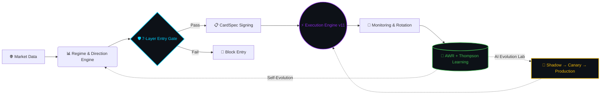

<div align="center">


# 🧠 Deep Reasoning OS (DROS)

**Research-first crypto futures trading architecture powered by 16 cooperative agents, deterministic safety, and recursive learning**

*Research-first architecture · Deterministic safety · Continuous self-improvement*


**[📖 Docs](#-documentation) · [🗺️ Roadmap](./ROADMAP.md) · [📡 Community](#-dros-research-community) · [🏢 Enterprise](#-enterprise--partnerships)**

</div>

---

## 💡 What is DROS?

**Deep Reasoning OS (DROS)** is a multi-agent autonomous trading system for **Binance USDT perpetual futures**.

16 AI agents collaborate in a structured pipeline — from market data ingestion, direction reasoning, and safety validation, through to execution, monitoring, and recursive self-learning. The system continuously evolves its own strategies through an AI Evolution Lab inspired by quality-diversity optimization research.

DROS is not a single-script trading bot.  
It is a **layered operating architecture** for decision, execution, validation, and continuous improvement.

> *"We don't outscale institutional capital. We outsee it — through microstructure."*

---

## ⚔️ Why DROS?

Most crypto grid bots are static. DROS operates at a different level at every layer.

| Capability | Typical Algo Bot | **DROS** |
| :--- | :---: | :---: |
| **Architecture** | Single script | 16 cooperative agents |
| **Grid Spacing** | Fixed value | Yang-Zhang volatility · SpacingOracleSSOT |
| **Direction** | Neutral only | Ensemble ML + Game Theory prediction |
| **Learning** | None or batch | AWR + Thompson Sampling (real-time, online) |
| **Self-Evolution** | Manual updates | AI Evolution Lab · MAP-Elites genome search |
| **Safety** | Simple stop-loss | 7-Layer Entry Gate · 43 invariant contracts |
| **Microstructure** | Price/volume only | VPIN + OFI fusion · SharedMemory <1ms |
| **Deployment** | All-or-nothing | Shadow → Canary (10%) → Production |
| **Backtesting** | Simple lookback | CPCV + PBO overfitting detection |
| **Transparency** | Closed | Open architecture, closed execution |

---

## ⚙️ System Architecture



**Execution comes only after deterministic validation. Every time.**

---

## 🧠 Core Pillars

<details>
<summary><strong>1. 16-Agent Cooperative Pipeline (A0–A15)</strong></summary>

Each agent owns exactly one responsibility — no duplicate calculations. The pipeline flows from data ingestion (A0–A2) through direction reasoning (A3–A5), safety validation (A6), grid design (A4), execution (A10–A11), monitoring (A12–A13), learning (A7–A8), and self-evolution coordination (A16).

Single Source of Truth (SSOT) principle: each parameter is computed by exactly one agent. Any bypass raises a named FAIL code.

→ [Full agent documentation](./docs/agents.md)

</details>

<details>
<summary><strong>2. SpacingOracleSSOT — Volatility-Adaptive Grid Spacing</strong></summary>

Grid spacing is computed from **Yang-Zhang volatility** (OHLC-integrated, statistically superior to ATR) through a single oracle. All 16 agents read from this oracle — no agent recalculates independently.

Rebuild hysteresis buffer + cooldown period prevent thrashing. ATR-only estimation is explicitly forbidden (`INVARIANT-SPACING-04`).

→ [Architecture details](./docs/architecture.md)

</details>

<details>
<summary><strong>3. 7-Layer Entry Gate — Deterministic Safety</strong></summary>

Every order attempt passes 7 sequential gates. Any single failure blocks execution:

1. **Macro Sentiment Veto** — Regime-level directional block
2. **Tail Risk Veto** — Extreme event probability check
3. **Direction Uncertainty Block** — Neutral Zone entry prevention (CLO/USDT defense)
4. **Range Extreme Check** — Price boundary validation
5. **Toxicity Shield** — VPIN-based institutional adverse flow detection
6. **Liquidation Probability Gate** — Real-time liq distance validation (AOSM v2)
7. **Card Freshness Gate** — Stale strategy rejection (AQER)

The 7-layer design emerged from two real liquidation events (Feb 2026). Every layer has a failure behind it.

→ [Full safety documentation](./docs/safety.md)

</details>

<details>
<summary><strong>4. Dual Online Learning — AWR + Thompson Sampling</strong></summary>

Two learning layers run in parallel, solving different problems:

- **Layer 1 — Thompson Sampling Bandit**: Selects the best preset configuration per symbol per rotation (~30 min). Bayesian Beta posterior, net ROI success metric (fees + funding deducted).
- **Layer 2 — AWR Agent (MDP)**: Continuous grid parameter adaptation via Advantage-Weighted Regression. Dense heartbeat reward every 5 minutes. Replay buffer of 10,000 samples, oldest auto-evicted.

BLS (Bayesian Learning Subprocess) runs isolated every 6 hours — OS fully reclaims memory on exit.

→ [Learning pipeline documentation](./docs/learning.md)

</details>

<details>
<summary><strong>5. AI Evolution Lab v3 — Self-Improving Architecture</strong></summary>

13 evolution modules apply the Strangler Fig pattern: new capabilities wrap the existing system without modifying core logic. EnhancerBus writes only to `DecisionPacket.extra_context` — main fields remain read-only.

Evolution pipeline: `Hypothesis → POPPER E-value → OPE Counterfactual → Digital Twin → Shadow (7d min) → Canary (SPA p<0.01) → Production`

Active production modules: ACI Risk · EventStore · Digital Twin · Counterfactual Lab · Black Swan Ensemble (2/4 vote) · Alpha Foundry (MAP-Elites) · OODA Loop

→ [AI Evolution Lab documentation](./docs/evolution-lab.md)

</details>

<details>
<summary><strong>6. Game Theory Engine — Market Microstructure Defense</strong></summary>

VPIN (Volume-synchronized Probability of Informed trading) fused with OFI (Order Flow Imbalance) via lock-free SharedMemory at <1ms latency. Detects institutional adverse selection before execution.

Stealth execution: game-theoretic order randomization prevents pattern exploitation by co-located HFT. CFR/DCFR regret minimization for optimal execution strategy under adversarial conditions.

→ [Execution documentation](./docs/execution.md)

</details>

---

## 📊 System Snapshot

| Component | Detail |
| :--- | :--- |
| **Active Agents** | 16 specialized AI agents |
| **Safety Layers** | 7-Layer Entry Gate · 43 invariant contracts |
| **Deployment Pipeline** | Shadow → Canary (10%) → Production |
| **Learning** | AWR (5-min heartbeat) + Thompson Sampling (30-min rotation) |
| **Evolution** | AI Evolution Lab · 13 modules · MAP-Elites genome search |
| **Platform** | Binance USDT Perpetual Futures |
| **Validation** | CPCV + PBO overfitting detection (academic standard) |
| **Academic refs** | 12 peer-reviewed papers (López de Prado, Easley, Adams & MacKay, Hasani…) |

---

## 📦 Open Architecture — What We Share

This repository is the **public architecture layer** of DROS.

**🟢 Open (this repository)**
- System architecture and agent pipeline design
- Safety gate principles and invariant contracts
- Learning methodology (AWR, Thompson Sampling, CPCV+PBO)
- Evolution framework (Strangler Fig, Shadow→Canary pipeline)
- Academic references and validation standards
- Failure case studies (MERL liquidation, CLO uncertainty event)

**🔴 Closed (proprietary)**
- Production daemon implementation (`execution/` layer)
- Learned strategy parameters and model weights
- Live configuration, positions, and runtime state
- Exact safety thresholds and calibration values
- Backtested return figures or live PnL data

> Architecture transparency builds community trust.  
> Execution parameters protect the system's edge.

---

## 📚 Documentation

| Document | Description |
| :--- | :--- |
| [Architecture](./docs/architecture.md) | Full system architecture and 16-agent pipeline |
| [Agents](./docs/agents.md) | Agent roles, contracts, and interaction patterns |
| [Safety](./docs/safety.md) | 7-Layer Entry Gate, invariant contracts, liquidation defense |
| [Learning](./docs/learning.md) | AWR + Thompson Sampling + BLS pipeline |
| [Execution](./docs/execution.md) | v11 execution engine, AQER, AOSM v2 |
| [Evolution Lab](./docs/evolution-lab.md) | AI Evolution Lab v3 — 13 modules |
| [FAQ](./docs/faq.md) | Common questions answered |
| [Performance](./docs/performance.md) | Operational metrics (no financial claims) |
| [Roadmap](./ROADMAP.md) | Completed milestones and upcoming work |

---

## 🛠️ Tech Stack

**Runtime:** Python 3.13+ · Apple MLX (M4 Pro NPU) · SQLite WAL · asyncio

**ML/Optimization:** XGBoost · LightGBM · PyTorch · pyribs MAP-Elites · FAISS

**Algorithms:** Yang-Zhang Volatility · Triple-Barrier Labels · CPCV · CFR/DCFR · VPIN+OFI · AWR · BOCPD · Hawkes Process · CfC Neural Networks

**Infrastructure:** Binance Futures REST+WebSocket · macOS launchd · POSIX SharedMemory

---

## 📡 DROS Research Community

Market microstructure is asymmetric. Institutional capital exploits patterns that most retail systems cannot detect.

DROS Research Lab shares **public-safe architecture insights, regime observations, and system design notes** with the community.

> No financial advice. No alpha signals. Engineering transparency only.
> No financial advice. No copied signals. Public-safe engineering notes only.

[](https://t.me/deepreasoningos)

**[→ Join DROS Research Lab](https://t.me/deepreasoningos)**

---

## 🏢 Enterprise & Partnerships

For exchange partners, quant funds, and institutional investors:

**Private architecture briefing available under NDA.**

- Technology licensing
- Strategic partnership conversations
- Institutional deployment consulting
- Acquisition discussions

📩 **[enterprise@deepreasoningos.com](mailto:enterprise@deepreasoningos.com)**

📋 **[Request the DROS deck](mailto:enterprise@deepreasoningos.com?subject=DROS%20Deck%20Request)**

*We do not use GitHub Issues for enterprise inquiries.*

---

## 📖 Citation

If you reference DROS architecture in academic work:

```bibtex
@software{dros2026,
  author    = {DROS Core Team},
  title     = {Deep Reasoning OS: A Multi-Agent Autonomous Trading Architecture},
  year      = {2026},
  url       = {https://github.com/dros-core/deep-reasoning-os}
}
```

Full citation format: [CITATION.cff](./CITATION.cff)

---

## 📋 Contributing

Architecture discussions, research references, and documentation improvements are welcome.  
See [CONTRIBUTING.md](./CONTRIBUTING.md) for scope and guidelines.

---

<div align="center">

*DROS is a quantitative research and systems architecture project.*  
*Nothing in this repository constitutes financial advice, investment solicitation, or a guarantee of future performance.*  
*All architecture notes and examples are for informational and research purposes only.*

</div>
