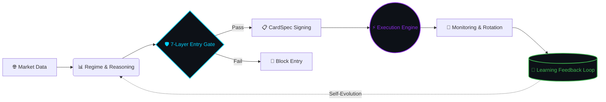

<div align="center">


# 🧭 Deep Reasoning OS (DROS)

**Research-first AI trading architecture for crypto futures —  
deterministic safety, adaptive grid execution, and self-improving learning.**

*16-Agent Autonomous Crypto Quant OS · Optimized for Apple Silicon*


**[Docs](#-documentation) · [Roadmap](./ROADMAP.md) · [Community](#-dros-research-community) · [Enterprise](#-enterprise--partnerships)**

</div>

---

## 💡 What is DROS?

**Deep Reasoning OS (DROS)** is a multi-agent autonomous trading system for **Binance USDT perpetual futures**.

16 AI agents collaborate in a structured pipeline — from market data ingestion, direction reasoning, and safety validation, through to execution, monitoring, and recursive self-learning.

DROS is not a single-script trading bot.  
It is a **layered operating architecture** for decision, execution, validation, and continuous improvement.

> *"We don't outscale Wall Street. We outsee them."*

---

## ⚔️ Why DROS? — The Asymmetric Edge

Most crypto grid bots are static. DROS is different at every layer.

| Feature | Typical Grid Bot | **DROS v11.20** |
| :--- | :---: | :---: |
| **Architecture** | Single script | **16-Agent collaborative pipeline** |
| **Grid Spacing** | Fixed value | **Yang-Zhang volatility · SpacingOracleSSOT** |
| **Direction** | Neutral only | **Ensemble ML + Game Theory prediction** |
| **Learning** | None | **AWR + Thompson Sampling dual online loop** |
| **Safety** | Simple stop-loss | **7-Layer Safety + liquidation probability** |
| **Microstructure** | Ignored | **VPIN + OFI + CFR toxicity detection** |
| **Evolution** | Manual updates | **AI Evolution Lab · OODA loop · Digital Twin** |
| **Deployment** | Direct to live | **Shadow → Canary → Production validation** |

---

## ⚙️ System Flow



**Execution comes only after deterministic validation. Every time.**

---

## 🧠 Core Components

<details>
<summary><strong>1. Direction Engine v5.0</strong> — Ensemble ML prediction with calibration</summary>

Ensemble ML (XGBoost · LightGBM · MLP) with Isotonic Regression calibration, Purged+Embargo CV validation, and dynamic threshold policy gates. LLM acts as a structurer — never a decision maker.

</details>

<details>
<summary><strong>2. SpacingOracleSSOT</strong> — Single source of truth for grid spacing</summary>

Yang-Zhang volatility estimation with 10% hysteresis and 30-minute cooldown. All agents reference one oracle — no duplicate calculations. ATR-only estimation forbidden (`INVARIANT-SPACING-04`).

</details>

<details>
<summary><strong>3. Entry Gate (7-Layer Safety)</strong> — Deterministic multi-layer validation</summary>

Every order passes 7 gates before execution: Macro Sentiment veto, Tail Risk veto, Direction Uncertainty block, Range Extreme check, Toxicity Shield (VPIN), Liquidation Probability gate, and Card Freshness gate.

</details>

<details>
<summary><strong>4. Execution Engine (v11.20)</strong> — Rolling grid with atomic state management</summary>

Rolling grid execution with TP/SL monitoring, ORPHAN position management, adaptive slot allocation (AOSM v2), and atomic checkpoint writes. 10,973-line production core.

</details>

<details>
<summary><strong>5. Learning Engine</strong> — Dual online learning loop</summary>

Two-layer online learning: **AWR Agent** (per-heartbeat dense reward MDP) + **Thompson Sampling Bandit** (per-rotation preset selection). Bayesian Learning Subprocess (BLS) runs in isolated subprocess for memory safety.

</details>

<details>
<summary><strong>6. Microstructure Engine</strong> — Sub-millisecond toxicity detection</summary>

VPIN + OFI toxicity fusion via SharedMemory (lock-free, <0.01ms). Avellaneda-Stoikov inventory pressure. Game-theoretic stealth execution with ±15% order jitter + Poisson timing.

</details>

<details>
<summary><strong>7. AI Evolution Lab v3</strong> — 13-module self-evolution system</summary>

EnhancerBus (Strangler Fig pattern): Alpha Foundry (MAP-Elites genome evolution) + OODA Loop (offline 03:00–09:00 KST) + Digital Twin (EPE/FRE/LPE parity) + Black Swan Ensemble (2/4 vote: ADWIN+CUSUM+BOCPD+Hawkes).

</details>

---

## 🛡️ Safety First

> **"Execution comes after validation. Always."**

DROS checks every condition before sending a single order:

| Gate | Check |
| :--- | :--- |
| `Macro Sentiment` | PSI ≤ −0.5 → Long blocked |
| `Tail Risk` | tail_risk ≥ 0.8 → All entry blocked |
| `Direction Uncertainty` | \|p_dir − 0.5\| ≤ 0.05 → Neutral zone blocked |
| `Range Extreme` | Price at range boundary → blocked |
| `Toxicity Shield` | VPIN toxicity score threshold → blocked |
| `Liquidation Probability` | liq_distance < safety threshold → blocked |
| `Card Freshness` | card_age > 5,400s → slot fill blocked |

The goal is not just performance. The goal is **survivable performance**.

<details>
<summary><strong>Battle-tested against real liquidation events</strong></summary>

- **2026-02-02 · MERLUSDT** · SHORT vs +37% LONG rally → 100% liquidation → 5-layer defense added
- **2026-02-04 · CLO/USDT** · p_dir=0.50 uncertainty → Neutral Zone ±5% gate added

Every safety layer has a real failure behind it.

</details>

---

## 🔬 AI Evolution Lab v3

Strategy evolution under strict scientific discipline.

```
New Hypothesis → Research Lab (POPPER E-value)
              → Counterfactual Lab (OPE Capped SNIPS)
              → Digital Twin (EPE/FRE/LPE parity <5%)
              → Shadow (min. 7 days)
              → Canary (10% traffic, SPA p<0.01)
              → Production
```

**Active modules (Production):** ACI Risk · EventStore (SQLite WAL) · Digital Twin · Counterfactual Lab · Black Swan Ensemble · Alpha Foundry · OODA Loop

**Key invariants:** No direct deployment without shadow. No post-hoc hypotheses. Black Swan requires 2/4 ensemble vote. OODA Decide/Act is offline-only.

---

## 📊 System Snapshot

| Component | Detail |
| :--- | :--- |
| **Active Agents** | 16 specialized AI agents |
| **Deployment Pipeline** | Shadow → Canary → Production |
| **Platform** | Binance USDT Perpetual Futures |
| **Learning** | AWR + Thompson Sampling (dual online) |
| **Safety Layers** | 7-Layer Entry Gate |
| **Core Daemon** | ~11,000 lines production code |
| **Test Suite** | 442 test files |
| **Evolution Modules** | 53 modules across 13 subsystems |

---

## 📦 Public Scope — Open-Core

This repository is the **public-facing documentation layer** of DROS.

**🟢 Included**

- Architecture overview and system diagrams
- Agent pipeline documentation (A0–A14)
- Safety gate specifications and invariant contracts
- Learning pipeline design
- Evolution Lab architecture
- Academic references and methodology

**🔴 Not Included**

- Live API keys or exchange credentials
- Private runtime state or checkpoint files
- ML model weights or trained parameters
- Production deployment configurations
- Proprietary execution infrastructure
- Strategy parameters or backtested return figures

---

## 📚 Documentation

| Document | Description |
| :--- | :--- |
| [Architecture](./docs/architecture.md) | Full system architecture and agent pipeline |
| [Agents](./docs/agents.md) | 16-Agent roles, contracts, and interaction patterns |
| [Safety](./docs/safety.md) | 7-Layer Entry Gate and invariant contracts |
| [Learning](./docs/learning.md) | AWR + Thompson Sampling + BLS pipeline |
| [Execution](./docs/execution.md) | v11 execution engine, AQER, AOSM |
| [Evolution Lab](./docs/evolution-lab.md) | AI Evolution Lab v3 — 13 modules |
| [FAQ](./docs/faq.md) | Common questions answered |
| [Performance](./docs/performance.md) | System operational metrics |
| [Roadmap](./ROADMAP.md) | Completed milestones and upcoming work |

---

## 🛠️ Tech Stack

**Runtime:** Python 3.13+ · Apple MLX (M4 Pro NPU) · SQLite WAL

**ML:** XGBoost · LightGBM · PyTorch · pyribs MAP-Elites · FAISS

**Algorithms:** Yang-Zhang Vol · Triple-Barrier · CPCV · CFR/DCFR · VPIN+OFI · AWR · BOCPD · Hawkes

**Infra:** Binance Futures REST+WebSocket · macOS launchd · POSIX SharedMemory · asyncio

---

## 📡 DROS Research Community

Market microstructure anomalies that institutional capital exploits.  
DROS Research Lab shares **public-safe regime alerts and architecture updates** with the community.

> Live research notes · Regime change signals · Architecture release previews

[](https://t.me/deepreasoningos)

**[→ Join DROS Research Lab](https://t.me/deepreasoningos)**

---

## 🏢 Enterprise & Partnerships

For exchange partners, quant funds, and institutional investors:

**Private architecture briefing available under NDA.**

- Technology licensing discussions
- Strategic partnership conversations
- Institutional deployment consulting

📩 **[enterprise@deepreasoningos.com](mailto:enterprise@deepreasoningos.com)**

*We do not accept unsolicited investment via GitHub Issues. Please use the email above.*

---

## 📖 Citation

```bibtex
@software{dros2026,
  author    = {DROS Core Team},
  title     = {Deep Reasoning OS: A Multi-Agent Autonomous Trading Architecture},
  year      = {2026},
  url       = {https://github.com/dros-core/deep-reasoning-os}
}
```

---

## 📋 Contributing

Architecture discussions, research references, and documentation improvements are welcome.  
See [CONTRIBUTING.md](./CONTRIBUTING.md) for scope and guidelines.

---

<div align="center">

*DROS is a quantitative research and systems architecture project.*  
*Nothing in this repository constitutes financial advice, investment solicitation, or a guarantee of future performance.*  
*All signals, architecture notes, and examples are for informational and research purposes only.*

</div>
