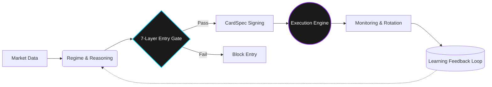

# 🧭 Deep Reasoning OS (DROS)

**"Not a hedge fund. A precision engine."** *16-Agent Autonomous Crypto Quant OS optimized for Apple Silicon.*

---

## 💡 What is DROS?

**Deep Reasoning OS (DROS)**는 바이낸스(Binance) USDT 선물을 위한 **16-Agent 자율 협력 트레이딩 시스템**입니다. 

단일 스크립트 기반의 단순한 봇(Bot)이 아닙니다. DROS는 데이터 수집, 방향 추론, 검증, 실행, 그리고 자가 학습까지 수행하는 **완전한 운영체제(OS) 아키텍처**입니다. 

> *"We don't outscale Wall Street. We outsee them."* > (우리는 규모로 압도하지 않습니다. 그들보다 먼저 볼 뿐입니다.)

 

## ⚔️ Why DROS? (The Asymmetric Edge)

대부분의 암호화폐 매매 봇은 정적(Static)입니다. DROS는 근본적인 구조부터 다릅니다.

| 기능 (Feature) | 일반 트레이딩 봇 | DROS v11.20 |
| :--- | :--- | :--- |
| **Architecture** | 단일 스크립트 / 단일 로직 | **16-Agent 협력 파이프라인** |
| **Learning** | 학습 불가 / 수동 최적화 | **AWR + Thompson Sampling 이중 온라인 학습** |
| **Safety** | 단순 손절 (Stop-Loss) | **7-Layer Safety + 청산 확률 동적 계산** |
| **Microstructure** | 호가창 데이터 미사용 | **VPIN + OFI + CFR 독성(Toxicity) 감지** |
| **Evolution** | 수동 파라미터 업데이트 | **AI Evolution Lab (자율 OODA 루프 진화)** |
| **Deployment** | 즉시 실거래 투입 | **Shadow → Canary → Production 다중 검증** |

 

## ⚙️ System Flow

 

## 🧠 Core Components

1. **Direction Engine v5.0**: 앙상블 ML(XGBoost, LightGBM)과 Isotonic Regression 보정을 거친 정밀한 방향 예측 엔진.
2. **SpacingOracleSSOT**: Yang-Zhang 변동성 기반의 단일진실(SSOT) 동적 격자(Grid) 간격 계산 모듈.
3. **Entry Gate (7-Layer Safety)**: 거시 경제 센티먼트부터 미시 호가창 독성까지 점검하는 결정론적 다중 안전 장치.
4. **Execution Engine**: 롤링 그리드 실행, 자본 가중 배분(Vampire Capital) 및 TP/SL 포지션 관리.
5. **Learning Engine**: AWR 기반의 적응형 학습과 베이지안 밴딧(Thompson Sampling) 프리셋 선택.
6. **Microstructure Engine**: VPIN, OFI 데이터를 통한 기관 역선택(Adverse Selection) 회피 및 게임 이론 기반 스텔스 실행.

 

## 🛡️ Safety First

> **"실행(Execution)은 철저한 검증(Validation) 이후에만 이루어집니다."**

DROS는 진입 전 아래의 조건들을 완벽히 통과해야만 실제 시장에 주문을 전송합니다.
* `Slot Availability` (안전한 진입 슬롯 확보)
* `Direction Confidence` (방향성 확신도 임계치 도달)
* `Funding Constraints` (펀딩비 제약 조건 통과)
* `Tail Risk` (극단적 꼬리 위험 회피)
* `Microstructure Toxicity` (호가창 유독성 / 기관 덤핑 사전 차단)
* `Liquidation Probability` (청산 확률 및 마진 안전성 검증)

 

## 📦 Public Scope (Open-Core)

이 깃허브 저장소는 DROS의 아키텍처와 시스템 철학을 공개하는 **퍼블릭 쇼케이스(Public Overview) 레이어**입니다.

* **🟢 포함됨 (Included):** 아키텍처 개요, 시스템 다이어그램, 불변 계약(Contracts) 문서, 안전 장치 명세.
* **🔴 제외됨 (Not Included):** 라이브 API 키, 개인 런타임 상태, ML 학습 가중치(Weights), 거래소 시크릿 및 프라이빗 배포 파일.

 

## 📡 Community & Signals

DROS 엔진이 탐지하는 **실시간 블랙스완 경보**와 **데일리 알파(Alpha)**는 공식 텔레그램 연구소에서 독점 공개됩니다.

**💼 Institutional Inquiries (B2B 연동 및 투자 문의):** `선생님의_이메일@주소.com`  
**🐦 Twitter (X):** `[@선생님의_트위터_아이디]`

---
*Disclaimer: DROS is a quantitative research project. The signals and algorithms discussed are for informational purposes only and do not constitute financial advice.*
