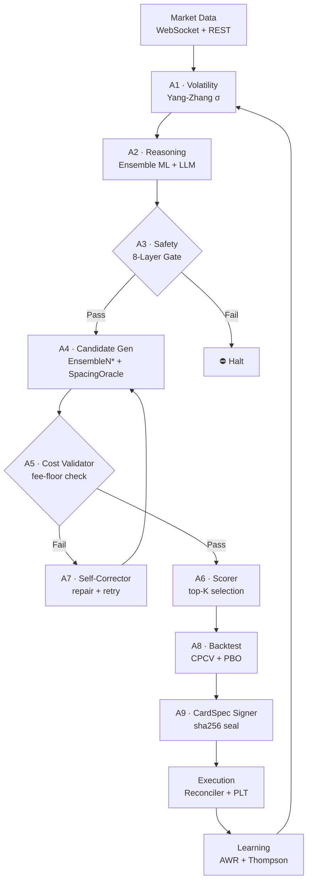

# DROS Architecture

→ [Back to README](../README.md) · [Agents reference](./agents.md)

---

## Full Pipeline

---

## Agent Call Chain

| Stage | Agent | Input | Output | Invariant |
|:------|:------|:------|:-------|:----------|
| Data | A1 | OHLCV + Funding | Yang-Zhang σ, ATR | SSOT: SpacingOracle |
| Reasoning | A2 | Market features | Ensemble ML + LLM bias | FAIL_LLM_DIRECT_CALL |
| Safety | A3 | All signals | Pass/Fail | 8-Layer Safety Gate |
| Candidate | A4 | Safety pass | CardSpec draft | EnsembleN*, SSOT |
| Validation | A5 | CardSpec | fee-floor check | FAIL_SPACING_TOO_TIGHT |
| Correction | A7 | Failed card | Repaired card | Only re-sign authority |
| Scoring | A6 | Validated cards | Top-K ranked | 12-metric composite |
| Backtest | A8 | Top-K cards | PBO-validated | CPCV+PBO, FAIL_PBO_OVERFIT |
| Signing | A9 | Validated card | sha256 sealed | FAIL_CARDSPEC_MUTATION |
| Execution | A10–A14 | CardSpec | Live orders | FSM, Reconciler, PLT |
| Evolution | A16 | All signals | Genome evolution | EVOL INVARIANTs |

---

## Local Inference Stack

DROS runs core logic entirely on-device — no cloud API calls for real-time decisions.

| Component | Technology | Benefit |
|:---|:---|:---|
| **ML Inference** | Apple MLX (Metal) | Sub-100ms latency on Apple Silicon |
| **LLM Layer** | Ollama (local) | Full data privacy, no external dependency |
| **SharedMemory** | POSIX mmap | Zero-copy inter-process communication |
| **Hardware** | Apple M4 Pro 24GB | Unified memory — ML + execution in same pool |

---

## Design Principles

| Principle | Description |
|:---|:---|
| **SSOT** | Each parameter computed by exactly one agent — no recomputation |
| **CardSpec Immutability** | sha256 seal prevents parameter drift after signing |
| **Staged Deployment** | Shadow → Canary → Production (SPA p < 0.01 gate) |
| **Advisory-Only LLM** | LLM bias is clamped to ±0.05 — never drives decisions alone |
| **Open Architecture** | Principles and patterns public; production implementation private |

---

→ [Back to README](../README.md) · [Agents reference](./agents.md) · [Safety documentation](./safety.md)
